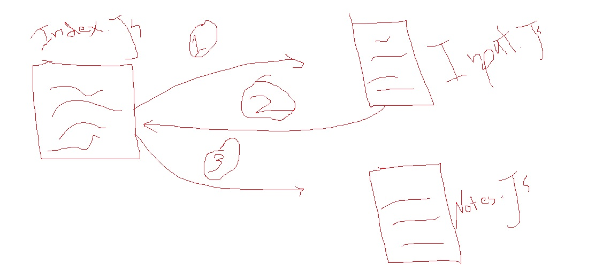

# LAB - Class 01

## Project: Terminal Notes App

### Author: Muhammed Tommalieh

### Links and Resources

- [submission PR](https://github.com/401-advanced-javascript-tommalieh/notes/pull/5)

### Setup

#### `.env` requirements (where applicable)

`MONGODB_URI`

#### How to initialize/run your application (where applicable)

`node index.js -a "<your note here>"`
or
`node index.js --a "<your note here>"`
or
`node index.js --add "<your note here>"`

#### How to use your library (where applicable)

`npm i minimist`
`npm i dotenv`
`npm i mongoose`

#### Tests

- run jest tests using:
  `npm test`

- rung lint test using:
  `npm run lint`

#### UML

